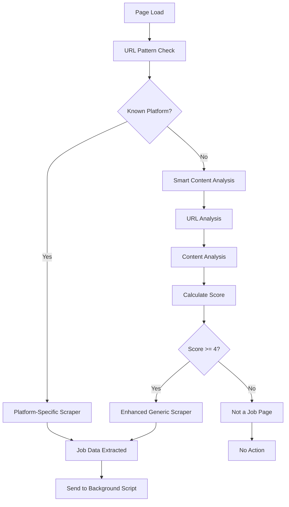

# 🚀 Enhanced Job Detection System

## Overview

The Tildra Job Copilot feature has been significantly enhanced to detect job postings across **any website**, not just major job boards. The new system uses advanced pattern recognition, content analysis, and semantic detection to identify job pages with high accuracy.

## Key Improvements

### 1. **Expanded Platform Coverage** 🌐

**Before**: Limited to ~10 major platforms (LinkedIn, Indeed, etc.)
**After**: Supports 40+ platforms including:

- **Major Job Boards**: LinkedIn, Indeed, Glassdoor, ZipRecruiter, Monster, etc.
- **ATS Platforms**: Greenhouse, Lever, Workday, AshbyHQ, Taleo, SmartRecruiters, iCIMS, etc.
- **Company Career Pages**: Google, Apple, Microsoft, Meta, Salesforce, Tesla, etc.
- **Generic Job Sites**: Any website with job-related content

### 2. **Smart Content Analysis** 🧠

The new system analyzes multiple signals to determine if a page is a job posting:

#### URL Analysis (Weight: 2-3 points each)
- Job-related path segments (`/jobs/`, `/careers/`, `/position/`)
- Job ID patterns (`/job-123`, `/position/abc-def`)
- Careers subdomains (`careers.company.com`)
- Application URLs (`/apply`, `/application`)

#### Content Analysis (Weight: 0.5-2 points each)
- Job title keywords (engineer, manager, developer, analyst, etc.)
- Job description keywords (responsibilities, requirements, qualifications)
- Section headers (about the role, job summary, what we offer)
- Structured job elements (job classes/IDs in DOM)
- Application forms presence
- Salary/compensation mentions

#### Confidence Scoring
- **Threshold**: 4+ points required for job detection
- **Confidence Score**: 0-1 scale based on total score
- **Detailed Logging**: All detection signals logged for debugging

### 3. **Enhanced Generic Scraping** ⚡

The generic job scraper now includes:

#### Intelligent Title Detection
- Prioritized selectors (job-specific first, then generic)
- Job keyword validation
- Cross-reference with page title
- Job term validation (`position`, `role`, `opportunity`)

#### Smart Company Name Extraction
- Multiple fallback methods
- URL subdomain extraction
- Page title parsing
- Content filtering (removes generic terms)

#### Advanced Description Scoring
- Content quality scoring based on job keywords
- Length-based bonuses with diminishing returns
- Best match selection from multiple candidates

### 4. **Platform-Specific Scrapers** 🔧

Enhanced scrapers for major platforms:

#### LinkedIn
- Updated selectors for current UI
- Multiple fallback strategies
- Dynamic content handling

#### Indeed
- Improved company name detection
- Better description extraction

#### Greenhouse
- Enhanced company logo handling
- Multiple content selectors

#### Lever
- iframe content handling
- URL-based company extraction

#### Workday
- Slow-loading page accommodation
- Automation ID targeting
- URL pattern matching

#### AshbyHQ
- CSS class targeting
- Title-based company extraction

## Detection Algorithm Flow



## Configuration

### Detection Thresholds
- **Minimum Score**: 4 points
- **High Confidence**: 8+ points
- **Maximum Confidence**: 10 points (capped at 1.0)

### Content Requirements
- **Job Title**: Required for successful detection
- **Job Description**: Minimum 200 characters
- **Company Name**: Optional but improves confidence

### Performance Optimizations
- **Debounced Detection**: Prevents excessive runs on dynamic sites
- **Smart Timing**: Longer delays for slow-loading ATS platforms
- **Memory Management**: Request cleanup and observer optimization

## Testing

### Test File: `test_enhanced_job_detection.html`
A comprehensive test page that simulates a typical job posting with:
- Proper job title and company structure
- Complete job description with standard sections
- Application form
- Job-related keywords and content

### Validation Checks
1. **URL Pattern Matching**: Tests generic and specific patterns
2. **Content Keyword Detection**: Validates job-related terms
3. **Structural Elements**: Checks for job-specific DOM elements
4. **Form Detection**: Identifies application forms
5. **Company Information**: Extracts company details

## Usage Examples

### Manual Testing
```javascript
// In browser console on any job page:
checkForAndScrapeJobDetails(true);
```

### Debug Information
The system provides detailed logging:
```
[Tildra Job Copilot] Job detection analysis: {
  urlScore: 4,
  contentScore: 6.5,
  totalScore: 10.5,
  threshold: 4,
  isJobPage: true,
  urlIndicators: ["path_job", "job_id_pattern"],
  contentIndicators: ["title_engineer", "content_responsibilities_3", ...]
}
```

## Benefits

### For Users
- **Universal Detection**: Works on any job site, not just major platforms
- **Higher Accuracy**: Reduces false positives and negatives
- **Better Data Quality**: More reliable job information extraction
- **Faster Performance**: Optimized detection and scraping

### For Developers
- **Extensible Architecture**: Easy to add new platforms
- **Comprehensive Logging**: Detailed debugging information
- **Modular Design**: Separate analysis functions for testing
- **Configuration Options**: Adjustable thresholds and parameters

## Future Enhancements

### Planned Improvements
- **Machine Learning**: AI-powered content classification
- **Language Support**: Multi-language job detection
- **Industry Classification**: Automatic job category detection
- **Salary Extraction**: Advanced compensation parsing
- **Location Parsing**: Geographic job location extraction

### Platform Expansion
- **International Job Boards**: Support for regional platforms
- **Niche Industries**: Specialized job sites (healthcare, finance, etc.)
- **Freelance Platforms**: Upwork, Fiverr, Freelancer detection
- **Government Jobs**: USAJobs, state portals, etc.

## Troubleshooting

### Common Issues
1. **Not Detecting Job Pages**: Check console for scoring details
2. **False Positives**: Adjust threshold or improve content filters
3. **Missing Content**: Verify selectors for specific platforms
4. **Performance Issues**: Check for excessive observer triggers

### Debug Commands
```javascript
// Test URL analysis
analyzeUrlForJobIndicators();

// Test content analysis  
analyzePageContentForJobIndicators();

// Full job page check
isLikelyJobPage();

// Force job detection
checkForAndScrapeJobDetails(true);
```

## Conclusion

The enhanced job detection system represents a significant improvement in the Tildra Job Copilot's ability to identify and extract job information from any website. With comprehensive pattern recognition, intelligent content analysis, and robust fallback mechanisms, users can now benefit from job copilot features across the entire web, not just major job boards. 